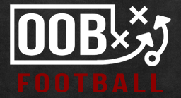
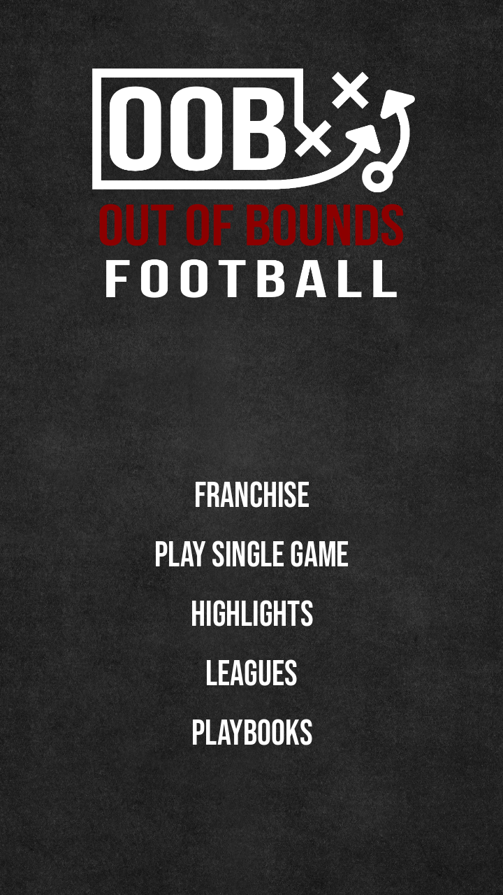
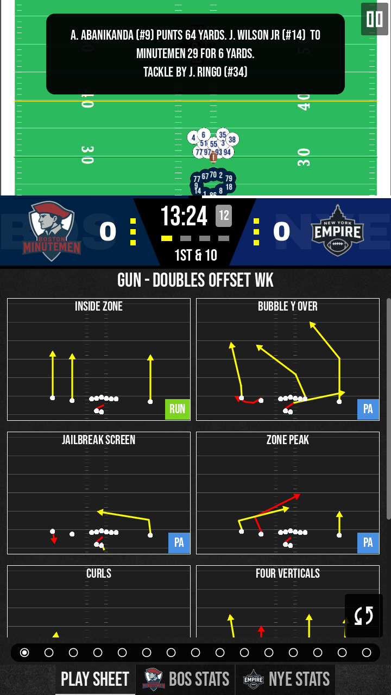

# Out Of Bounds Football

An (American) football management sim for mobile. Think Sega’s Football Manager, but for football, not fútbol.

> [!NOTE]  
> This repository contains documentation and resources for customizing Out Of Bounds Football (leagues, playbooks, etc.). The game's source code is not public at this time.

## Development

OOB Football is currently in very early access and available only for Android devices.

## Download

- Google Play link coming soon
- Apple App Store link coming shortly after

## Current Features

- Play in portrait mode!
- Full play-calling with physics-based outcomes
- Experience the thrill of football, reimagined with tiny, determined dots
- Not happy with your team? Fantasy draft an entirely new roster (useful for Jets fans!)
- Import leagues with all your favorite players
- Save replays of your best plays
- Stats for each game and full seasons

## Soon-to-Be Features

- Player progression
- Roster management
- Play and playbook customization
- Coach and management AI

## Coming Soon to the Field

- Fatigue
- Injuries
- Substitutions
- Fumbles
- Clock management

## Credits

- Built with [Godot Engine 4](https://godotengine.org/)
- Some icons used in this project are from Google’s Material Icons collection ([link](https://fonts.google.com/icons)), licensed under the [Apache License 2.0](https://www.apache.org/licenses/LICENSE-2.0).
- This project uses SQLite, which is in the public domain. See [SQLite copyright](https://sqlite.org/copyright.html) for details.
- Game data and play-by-play information provided by [nflfastR](https://nflfastr.com/).

## Contact

- [matt@pseudocoder.com](mailto:matt@pseudocoder.com)